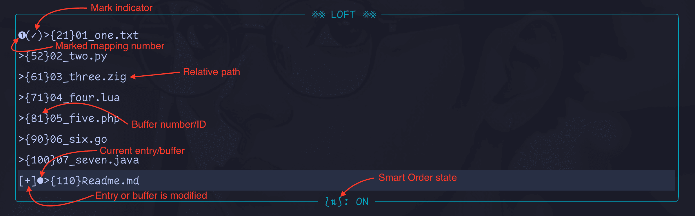

<div align="center">
  
  <h3 align="center"><code> ⨳⨳ LOFT ⨳⨳ </code></h3>
  <p align="center">Streamlined plugin for productive buffer management</p>
</div>
<br />

## Table of Content

- [Introduction](#introduction)
- [Installation](#installation)
- [Configuration](#configuration)
  - [Default Options](#default-options)
- [Commands](#commands)
- [Roadmap](#roadmap)

## Introduction

https://github.com/user-attachments/assets/312a06be-a2c0-4f4f-9fd2-e404c737cb89

Loft is a powerful yet lightweight Neovim plugin that makes buffer management fast, intuitive, and frustration-free—so you can focus on what truly matters. 🚀

### 🛑 The Problem: Buffer Chaos!

Imagine your Neovim buffer list is like a messy desk. You start with a clean workspace, but as the day goes on, files pile up—some important, others just distractions. Before you know it, you’re **digging through a jungle of buffers**, closing the wrong ones, and losing track of key files.

Ever rage-quit Neovim just to start fresh? You’re not alone.

### ✅ The Solution: Loft 🔥

<div align="center">
  
</div>

Loft uses a registry to manage state and track buffers that can be cyclically navigated to. It provides a floating UI that lists these buffers as rearrangeable entries in order of recency from bottom to top. The catch is in Loft's flagship features—**Smart Ordering** and **Marking**:

- #### ⟅⇅⟆ Smart Ordering

  The smart ordering feature (represented with the symbol `⟅⇅⟆`) dynamically arranges your buffers based on recency. This means that if you navigate to a buffer without any Loft's action (say via [Telescope](https://github.com/nvim-telescope/telescope.nvim)), that buffer will be move to the last position in the registry. If you have Telescope installed, by default, the current buffer before navigation will be moved to second to the last position.

- #### (✓) Marking

  The marking feature allows you to bookmark important buffers. The marked buffers/entries (identified by the symbol `(✓)`) can be specially navigated to cyclically or by keybinding. You read right, keybinding; the nine most recent buffers are automatically mapped for quick access anytime.

No more scrambling to find where you left off. No more accidental closures. **Just smooth, intelligent buffer management.** 🚀

## Installation

**Note**: Loft requires Neovim 0.8+

Using [lazy.nvim](https://github.com/folke/lazy.nvim):

```lua
{
  "iamgideonidoko/loft.nvim",
  config = true, -- Calls setup automatically
}
```

## Configuration

You need to call the plugin's `setup()` method if you haven't yet:

```lua
require("loft").setup()
```

### Default Options

```lua
local actions = require("loft.actions")
require("loft").setup({
  -- Whether to move the current buffer to the second to last position (just before the
  -- selected buffer, which will be the last position) in the registry during Telescope selection
  move_curr_buf_on_telescope_select = true,
  close_invalid_buf_on_switch = true, -- Whether to close invalid buffers during navigation
  enable_smart_order_by_default = true, -- Whether to enable smart order by default
  smart_order_marked_bufs = false, -- Whether smart order (`⟅⇅⟆`) should reposition marked buffers
  enable_recent_marked_mapping = true, -- Whether the 9 most recently marked buffers should be switched to with a mapping (with keymaps)

  -- The character to use after leader when assigning keymap to the 9 most recently marked buffers
  post_leader_marked_mapping = "l",  -- Maps to <leader>l1...9 for navigation
  show_marked_mapping_num = true, -- Whether to show the mapping number for the 9 most recently marked buffers
  marked_mapping_num_style = "solid", -- The style of the mapping number
  window = {
    width = nil, -- Defaults to calculated width
    height = nil, -- Defaults to calculated height
    zindex = 100,
    title_pos = "center",
    border = "rounded",
  },
  keymaps = {
    --NB: all movements/navigations are cyclic
    -- Keybindings specific to Loft main UI
    ui = {
      ["k"] = "move_up", -- Move cursor up
      ["j"] = "move_down", -- Move cursor down
      ["<C-k>"] = "move_entry_up", -- Move entry (+buffer)
      ["<C-j>"] = "move_entry_down", -- Move entry (+buffer)
      ["<C-d>"] = "delete_entry", -- Delete entry (+buffer)
      ["<CR>"] = "select_entry", -- Select entry (+buffer)
      ["<Esc>"] = "close", -- Close Loft
      ["q"] = "close",
      ["x"] = "toggle_mark_entry", -- Mark or unmark entry
      ["<C-s>"] = "toggle_smart_order", -- Enable or disable smart order status
      ["?"] = "show_help", -- Show Loft help menu
      ["<M-k>"] = "move_up_to_marked_entry", -- Move up to the next marked entry
      ["<M-j>"] = "move_down_to_marked_entry", -- Move down to the next marked entry
    },
    -- Keybindings specific to editor
    general = {
      ["<leader>lf"] = actions.open_loft, -- Open Loft
      ["<Tab>"] = actions.switch_to_next_buffer, -- Navigate to the next buffer
      ["<S-Tab>"] = actions.switch_to_prev_buffer, -- Navigate to the prev buffer
      ["<leader>x"] = actions.close_buffer, -- Close buffer
      ["<leader>X"] = {
        callback = function()
          actions.close_buffer({ force = true })
        end,
        desc = "Force close buffer",
      },
      ["<leader>ln"] = actions.switch_to_next_marked_buffer, -- Navigate to the next marked buffer
      ["<leader>lp"] = actions.switch_to_prev_marked_buffer, -- Navigate to the previous marked buffer
      ["<leader>lm"] = actions.toggle_mark_current_buffer, -- Mark or unmark the current buffer
      ["<leader>ls"] = actions.toggle_smart_order, -- Toggle Smart Order ON and OFF
      ["<leader>la"] = actions.switch_to_alt_buffer, -- Switch to alternate buffer without updating the registry
    },
  },
})
```

## Commands

| Commands                | Description                                |
| ----------------------- | ------------------------------------------ |
| `:LoftToggle`           | Open or close the Loft UI.                 |
| `:LoftToggleSmartOrder` | Enable or disable the smart order feature. |
| `:LoftToggleMark`       | Toggle mark current buffer.                |

## Autocmds

Loft user autocmds:

| Event                       | Description                                    | Argument                                  |
| --------------------------- | ---------------------------------------------- | ----------------------------------------- |
| `User LoftBufferMark`       | Triggered when a buffer is marked or unmarked. | `{ mark_state: boolean, buffer: number }` |
| `User LoftSmartOrderToggle` | Triggered when smart order state is toggled.   | `smart_order_state: number`               |

## Tips

If you think bufferline sucks and prefer working with the info in statusline like me then you can show the smart order and marked info in your statusline.

Get the info from Loft UI's `smart_order_indicator()` and `get_buffer_mark()` methods and infuse like so:

```lua
vim.api.nvim_set_hl(0, "MiniStatuslineFilename", { fg = "#FFD700", bg = "#262D43", bold = true })
vim.api.nvim_set_hl(0, "StatusLineLoftSmartOrder", { fg = "#ffffff", bg = "#005f87", bold = true })
local smart_order_status = "%#StatusLineLoftSmartOrder#" .. require("loft.ui"):smart_order_indicator()
local buffer_mark = require("loft.ui"):get_buffer_mark()
local filename = MiniStatusline.section_filename({ trunc_width = 140 })
MiniStatusline.combine_groups({
  -- ...
  { hl = "StatusLineLoftSmartOrder", strings = { smart_order_status } },
  "%<",
  -- ...
  { hl = "MiniStatuslineFilename", strings = { filename .. buffer_mark } },
  "%=",
  -- ...
})
```

Then listen for the following Loft's user autocmds and redraw your statusline:

```lua
vim.api.nvim_create_autocmd("User", {
  pattern = { "LoftSmartOrderToggle", "LoftBufferMark" },
  callback = function()
    vim.cmd("redrawstatus")
  end,
})
```

Here's what your statusline would look like:

<div>
  
</div>

## Contributing

Contributions are welcome! Please feel free to check out the [contribution guide](./CONTRIBUTING.md).

## Roadmap

- Implement CI/CD to run formatter, lint, and tests.
- Registry/state persistence across sessions (investigate the plugin experience with session persistence plugins)
- Add buffer-relative UI to show info like the filename/path, marked/modified state, etc. (I'll only get to this if it's requested by many)
