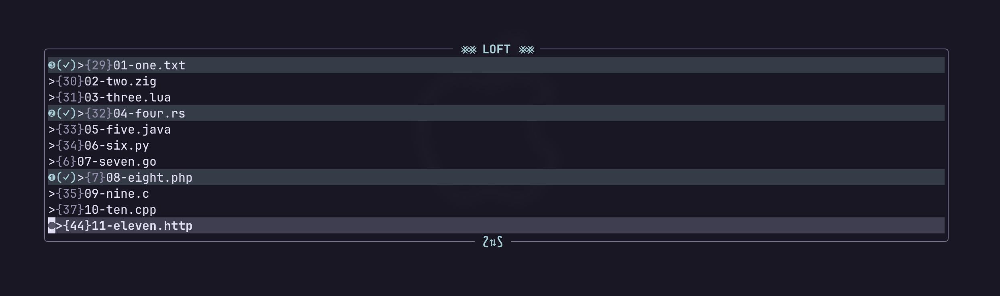
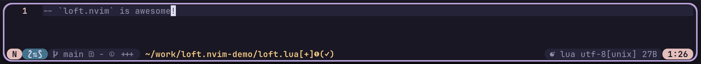

<div align="center">
  <h3 align="center"><code> ⨳⨳ LOFT ⨳⨳ </code></h3>
  <p align="center">The missing buffer management tool<br />A sleek, no-nonsense plugin built to tame your buffers and supercharge your flow.</p>
</div>
<br />

## Table of Content

- [Introduction](#introduction)
- [Installation](#installation)
- [Configuration](#configuration)
  - [Default Options](#default-options)
- [Commands](#commands)
- [Highlights](#highlights)
- [Window options](#window-options)
- [Roadmap](#roadmap)

## Introduction

Loft is a powerful yet lightweight Neovim plugin that makes buffer management fast, intuitive, and frustration-free—so you can focus on what truly matters.

### 🛑 The Problem: Buffer Chaos!

Imagine your Neovim buffer list is like a messy desk. You start with a clean workspace, but as the day goes on, files pile up—some important, others just distractions. Before you know it, you’re **digging through a jungle of buffers**, closing the wrong ones, and losing track of key files.

Ever rage-quit Neovim just to start fresh? You’re not alone.

### ✅ The Solution: Loft

<div align="center">
  
</div>

Loft uses a registry to manage state and track buffers that can be cyclically navigated to. It provides a floating UI that lists these buffers as rearrangeable entries in order of recency from bottom to top. The catch is in Loft's flagship features—**Smart Ordering** and **Marking**:

- #### ⟅⇅⟆ Smart Ordering

  The smart ordering feature (represented with the symbol `⟅⇅⟆`) dynamically arranges your buffers based on recency. This means that if you navigate to a buffer without any Loft's action (say via [Telescope](https://github.com/nvim-telescope/telescope.nvim)), that buffer will be move to the last position in the registry. Also, the current buffer before navigation will be moved to second to the last position.

- #### (✓) Marking

  The marking feature allows you to bookmark important buffers. The marked buffers/entries (identified by the symbol `(✓)`) can be specially navigated to cyclically or by keybinding. You read right, keybinding; the nine most recent buffers are automatically mapped for quick access anytime.

No more scrambling to find where you left off. No more accidental closures. **Just smooth, intelligent buffer management.** 🔥

## Installation

**Note**: Loft requires Neovim 0.8+

Using [lazy.nvim](https://github.com/folke/lazy.nvim):

```lua
{
  "iamgideonidoko/loft.nvim",
  config = true, -- Calls setup automatically
}
```

## Configuration

You need to call the plugin's `setup()` method if you haven't yet:

```lua
require("loft").setup()
```

### Default Options

```lua
local actions = require("loft.actions")
require("loft").setup({
  close_invalid_buf_on_switch = true, -- Whether to close invalid buffers during navigation
  enable_smart_order_by_default = true, -- Whether to enable smart order by default
  smart_order_marked_bufs = false, -- Whether smart order (`⟅⇅⟆`) should reposition marked buffers
  smart_order_alt_bufs = false, -- Whether smart order (`⟅⇅⟆`) should reposition alternate buffers
  -- When false (default), switching focus to a different window split or tab will NOT
  -- reorder the registry. Smart reordering only applies when the buffer itself changes
  -- within the same window. Set to true to restore the old behaviour.
  smart_order_on_window_switch = false,
  enable_recent_marked_mapping = true, -- Whether the 9 most recently marked buffers should be switched to with a mapping (with keymaps)

  -- The character to use after leader when assigning keymap to the 9 most recently marked buffers
  post_leader_marked_mapping = "l",  -- Maps to <leader>l1...9 for navigation
  show_marked_mapping_num = true, -- Whether to show the mapping number for the 9 most recently marked buffers
  marked_mapping_num_style = "solid", -- The style of the mapping number

  --[[ The timeout in milliseconds to wait before closing the UI after moving the current buffer.
  Defaults to 800. Set to 0 to disable the UI from showing at all. ]]
  ui_timeout_on_curr_buf_move = 800,

  -- Display the buffer list in reverse order (first/oldest registry entry at the bottom).
  -- All navigation, reordering, and marked-buffer jumps continue to work correctly.
  reverse_order = false,

  -- Whether to show a confirmation prompt before force-deleting buffers (D / visual D).
  -- Set to false to skip the prompt (useful for advanced users or CI environments).
  confirm_force_delete = true,

  -- Whether deleting the current buffer (marked ●) from the Loft UI is allowed.
  -- Set to false to prevent the current buffer from being deleted via the UI, which can be a helpful safeguard against accidental closures.
  allow_delete_current_buffer = true,

  -- ── Main UI window ───────────────────────────────────────────────────────
  window = {
    width = nil,   -- Explicit width; defaults to 80% of editor columns
    height = nil,  -- Explicit height; defaults to registry size capped at 80% of lines

    -- Positioning: row/col override the default centred calculation.
    -- row_offset/col_offset are added on top of whichever row/col is used.
    row = nil,        -- Explicit row (0-indexed from top of editor)
    col = nil,        -- Explicit col (0-indexed from left of editor)
    row_offset = 0,   -- Shift window vertically (positive = down)
    col_offset = 0,   -- Shift window horizontally (positive = right)

    -- Title and footer (Neovim 0.9+ for title, 0.10+ for footer).
    -- When nil the auto-generated Loft title / smart-order indicator is used.
    title = nil,       -- Custom title string (nil = auto)
    title_pos = "center",
    footer = nil,      -- Custom footer string (nil = smart-order indicator)
    footer_pos = "center",

    zindex = 100,
    border = "rounded",  -- "none"|"single"|"double"|"rounded"|"solid"|"shadow"|string[]
  },

  -- ── Help window ──────────────────────────────────────────────────────────
  -- Opened with the `show_help` keymap (default: `?`).
  -- Inherits border from the main window when not set.
  -- zindex is always clamped to > main window zindex.
  help_window = {
    disable = false,  -- Set to true to disable the help window entirely

    width = nil,   -- Defaults to 70
    height = nil,  -- Defaults to content height capped at 80% of lines

    row = nil,        -- Explicit row (nil = centred)
    col = nil,        -- Explicit col (nil = centred)
    row_offset = 0,
    col_offset = 0,

    border = nil,     -- Inherits main window border when nil
    zindex = nil,     -- Defaults to main zindex + 10; always clamped > main zindex
  },
  keymaps = {
    --NB: all movements/navigations are cyclic
    -- Keybindings specific to Loft main UI (normal mode)
    ui = {
      ["k"] = "move_up", -- Move cursor up
      ["j"] = "move_down", -- Move cursor down
      ["<C-k>"] = "move_entry_up", -- Move entry (+buffer)
      ["<C-j>"] = "move_entry_down", -- Move entry (+buffer)
      ["dd"] = "delete_entry", -- Delete entry (+buffer)
      ["D"] = "force_delete_entry", -- Force delete entry (no save prompt)
      ["<CR>"] = "select_entry", -- Select entry (+buffer)
      ["<Esc>"] = "close", -- Close Loft
      ["q"] = "close",
      ["m"] = "toggle_mark_entry", -- Mark or unmark entry
      ["<C-s>"] = "toggle_smart_order", -- Enable or disable smart order status
      ["?"] = "show_help", -- Show Loft help menu
      ["<M-k>"] = "move_up_to_marked_entry", -- Move up to the next marked entry
      ["<M-j>"] = "move_down_to_marked_entry", -- Move down to the next marked entry
    },
    -- Keybindings specific to Loft main UI (visual mode)
    ui_visual = {
      ["d"] = "delete_selected_entries", -- Delete visually selected entries
      ["D"] = "force_delete_selected_entries", -- Force delete selected entries (no save)
    },
    -- Keybindings specific to editor
    general = {
      ["<leader>lf"] = actions.open_loft, -- Open Loft
      ["<Tab>"] = actions.switch_to_next_buffer, -- Navigate to the next buffer
      ["<S-Tab>"] = actions.switch_to_prev_buffer, -- Navigate to the prev buffer
      ["<leader>x"] = actions.close_buffer, -- Close buffer
      ["<leader>X"] = {
        callback = function()
          actions.close_buffer({ force = true })
        end,
        desc = "Force close buffer",
      },
      ["<leader>ln"] = actions.switch_to_next_marked_buffer, -- Navigate to the next marked buffer
      ["<leader>lp"] = actions.switch_to_prev_marked_buffer, -- Navigate to the previous marked buffer
      ["<leader>lm"] = actions.toggle_mark_current_buffer, -- Mark or unmark the current buffer
      ["<leader>ls"] = actions.toggle_smart_order, -- Toggle Smart Order ON and OFF
      ["<leader>la"] = actions.switch_to_alt_buffer, -- Switch to alternate buffer without updating the registry
      ["<S-M-i>"] = actions.move_buffer_up, --  Move the current buffer up while showing the UI briefly
      ["<S-M-o>"] = actions.move_buffer_down, --  Move the current buffer down while showing the UI briefly
    },
  },
  -- Session persistence: saves registry order, marks and smart order state to disk
  -- per working directory, and restores them on the next startup.
  persistence = {
    enabled = false, -- Opt-in: set to true to enable
    path = nil,      -- Defaults to stdpath("data")/loft/<cwd_hash>.json
  },
})
```

### Session plugin compatibility

When `persistence.enabled = true`, loft hooks into the following events to
restore state after a session is loaded:

| Plugin                                                                            | Event hooked                                   |
| --------------------------------------------------------------------------------- | ---------------------------------------------- |
| Native `:mksession` / any `:source session.vim`                                   | `SessionLoadPost` (Neovim built-in)            |
| [folke/persistence.nvim](https://github.com/folke/persistence.nvim)               | `User PersistenceLoadPost` + `SessionLoadPost` |
| [olimorris/persisted.nvim](https://github.com/olimorris/persisted.nvim)           | `User PersistedLoadPost` + `SessionLoadPost`   |
| [stevearc/resession.nvim](https://github.com/stevearc/resession.nvim)             | `User ResessionLoadPost`                       |
| [rmagatti/auto-session](https://github.com/rmagatti/auto-session)                 | `SessionLoadPost`                              |
| [Shatur/neovim-session-manager](https://github.com/Shatur/neovim-session-manager) | `SessionLoadPost`                              |
| No session plugin                                                                 | deferred `VimEnter` fallback                   |

**possession.nvim note**: [jedrzejboczar/possession.nvim](https://github.com/jedrzejboczar/possession.nvim) executes sessions via `nvim_exec2` instead of `:source`, so neither `SessionLoadPost` nor a post-load User event fires. Call loft's restore manually in your `after_load` hook:

```lua
require("possession").setup({
  hooks = {
    after_load = function()
      local p = require("loft.persistence")
      local cfg = require("loft.config").all.persistence
      p.restore(require("loft.registry"), cfg)
    end,
  },
})
```

## Commands

| Command                 | Description                                                                              |
| ----------------------- | ---------------------------------------------------------------------------------------- |
| `:LoftToggle`           | Open or close the Loft UI.                                                               |
| `:LoftToggleSmartOrder` | Enable or disable the smart order feature.                                               |
| `:LoftToggleMark`       | Toggle mark on the current buffer.                                                       |
| `:LoftCloseOthers`      | Close all buffers except the current one.                                                |
| `:LoftCloseOthers!`     | Force-close all other buffers (ignores modified state).                                  |
| `:LoftCloseUnmarked`    | Close all unmarked buffers. Mark what you want to keep, then run this to clear the rest. |
| `:LoftCloseUnmarked!`   | Force-close all unmarked buffers.                                                        |

## Native UI keymaps

Loft uses **normal-mode** mappings so you never have to enter insert mode.

### Normal mode (inside Loft)

| Key         | Action                       | Notes                                                             |
| ----------- | ---------------------------- | ----------------------------------------------------------------- |
| `k`         | Move cursor up (cyclic)      |                                                                   |
| `j`         | Move cursor down (cyclic)    |                                                                   |
| `<C-k>`     | Move entry up in list        |                                                                   |
| `<C-j>`     | Move entry down in list      |                                                                   |
| `dd`        | Delete entry + buffer        | Closes the buffer (no save prompt)                                |
| `D`         | Force-delete entry + buffer  | Bypasses modified check; prompts if `confirm_force_delete = true` |
| `m`         | Toggle mark on entry         |                                                                   |
| `<CR>`      | Select entry (switch to buf) |                                                                   |
| `q`/`<Esc>` | Close Loft                   |                                                                   |
| `<C-s>`     | Toggle smart order           |                                                                   |
| `?`         | Open help window             |                                                                   |
| `<M-k>`     | Jump to prev marked entry    |                                                                   |
| `<M-j>`     | Jump to next marked entry    |                                                                   |

### Visual mode (inside Loft)

Select multiple lines with `V` then:

| Key | Action                            | Notes                                         |
| --- | --------------------------------- | --------------------------------------------- |
| `d` | Delete selected entries + buffers |                                               |
| `D` | Force-delete selected entries     | Prompts once if `confirm_force_delete = true` |

### Disabling or remapping

Set any keymap to `false` to disable it, or provide a different key:

```lua
require("loft").setup({
  keymaps = {
    ui = {
      ["D"] = false,       -- Disable force-delete
      ["<C-d>"] = "delete_entry", -- Add back an old-style binding
    },
    ui_visual = {
      ["D"] = false,       -- Disable visual force-delete
    },
  },
  confirm_force_delete = false, -- Skip confirmation prompt
})
```

## Highlights

Loft applies dedicated highlight groups to its UI so the buffer list is visually
scannable at a glance and fully themeable. All groups use `default = true`, meaning
your colorscheme (or your own `vim.api.nvim_set_hl` calls) take priority — you never
need to clear Loft's definitions first.

### Highlight groups

| Group                  | Default link     | Applied to                                              |
| ---------------------- | ---------------- | ------------------------------------------------------- |
| `LoftCurrentBuffer`    | `PmenuSel`       | Full line — the buffer that was active when Loft opened |
| `LoftMarkedBuffer`     | `DiffAdd`        | Full line — marked / pinned buffers                     |
| `LoftMark`             | `DiagnosticInfo` | The `(✓)` / `➊`–`➒` mark symbol                         |
| `LoftCurrentIndicator` | `Statement`      | The `●` current-buffer dot                              |
| `LoftModified`         | `DiagnosticWarn` | The `[+]` unsaved-changes indicator                     |
| `LoftBufferNumber`     | `Comment`        | The `{N}` buffer-number token                           |

Line-level groups (`LoftCurrentBuffer`, `LoftMarkedBuffer`) set the background for the
entire line. Inline groups are layered on top at higher priority, so their foreground
colours remain visible against the line background.

### Overriding highlight groups

Set your overrides **after** your colorscheme loads so they are not cleared on theme
change:

```lua
-- Example: make the current-buffer line stand out with a custom colour
vim.api.nvim_set_hl(0, "LoftCurrentBuffer", { bg = "#264F78", bold = true })

-- Example: dim the buffer-number column even further
vim.api.nvim_set_hl(0, "LoftBufferNumber", { fg = "#555555" })
```

Or hook into the `ColorScheme` autocmd if you want the override to survive theme switches:

```lua
vim.api.nvim_create_autocmd("ColorScheme", {
  callback = function()
    vim.api.nvim_set_hl(0, "LoftCurrentBuffer", { bg = "#264F78", bold = true })
  end,
})
```

## Window options

Loft exposes separate configuration tables for the **main UI window** and the **help window**.
Both sit inside `require("loft").setup({})`.

### Main window (`window`)

| Option       | Type                        | Default                           | Description                        |
| ------------ | --------------------------- | --------------------------------- | ---------------------------------- |
| `width`      | `integer\|nil`              | 80 % of columns                   | Explicit window width              |
| `height`     | `integer\|nil`              | registry size (max 80 % of lines) | Explicit window height             |
| `row`        | `integer\|nil`              | centred                           | Absolute row position (0-indexed)  |
| `col`        | `integer\|nil`              | centred                           | Absolute col position (0-indexed)  |
| `row_offset` | `integer`                   | `0`                               | Added to the computed/explicit row |
| `col_offset` | `integer`                   | `0`                               | Added to the computed/explicit col |
| `title`      | `string\|nil`               | auto (Loft name)                  | Custom title; Neovim ≥ 0.9 only    |
| `title_pos`  | `"left"\|"center"\|"right"` | `"center"`                        | Title alignment                    |
| `footer`     | `string\|nil`               | auto (smart-order indicator)      | Custom footer; Neovim ≥ 0.10 only  |
| `footer_pos` | `"left"\|"center"\|"right"` | `"center"`                        | Footer alignment                   |
| `zindex`     | `integer`                   | `100`                             | Float z-index                      |
| `border`     | `string\|string[]`          | `"rounded"`                       | Border style                       |

**Positioning example** — pin the window to the bottom of the screen, slightly inset:

```lua
require("loft").setup({
  window = {
    row = vim.o.lines - 12,  -- near the bottom
    col_offset = 4,           -- shift right by 4 columns
    height = 10,
    border = "single",
    title = " my buffers ",
    title_pos = "left",
  },
})
```

### Help window (`help_window`)

The help window is opened with the `show_help` keymap (default `?`). It inherits the
main window's `border` when its own `border` is not set, and its `zindex` is always
clamped to be greater than the main window's `zindex` so it always floats on top.

| Option       | Type               | Default                            | Description                                        |
| ------------ | ------------------ | ---------------------------------- | -------------------------------------------------- |
| `disable`    | `boolean`          | `false`                            | Set `true` to prevent the help window from opening |
| `width`      | `integer\|nil`     | `70`                               | Explicit width                                     |
| `height`     | `integer\|nil`     | content height (max 80 % of lines) | Explicit height                                    |
| `row`        | `integer\|nil`     | centred                            | Absolute row position                              |
| `col`        | `integer\|nil`     | centred                            | Absolute col position                              |
| `row_offset` | `integer`          | `0`                                | Added to the computed/explicit row                 |
| `col_offset` | `integer`          | `0`                                | Added to the computed/explicit col                 |
| `border`     | `string\|string[]` | inherits `window.border`           | Border style                                       |
| `zindex`     | `integer\|nil`     | `window.zindex + 10`               | Float z-index (always > main zindex)               |

```lua
require("loft").setup({
  help_window = {
    disable = false,
    border = "double",  -- different border from the main window
    row_offset = -2,    -- shift slightly upward
  },
})
```

## Autocmds

Loft fires the following `User` autocmds:

| Event                       | Description                                        | `ev.data`                                 |
| --------------------------- | -------------------------------------------------- | ----------------------------------------- |
| `User LoftBufferMark`       | A buffer was marked or unmarked.                   | `{ buffer: number, mark_state: boolean }` |
| `User LoftSmartOrderToggle` | Smart order was toggled on or off.                 | `{ smart_order_state: boolean }`          |
| `User LoftRegistryChanged`  | The registry mutated (add, remove, reorder, mark). | _(no data)_                               |
| `User LoftBufferSwitch`     | Loft navigated to a buffer (next/prev/marked/alt). | `{ buffer: number, source: string }`      |

The `source` field in `LoftBufferSwitch` is one of: `"next"`, `"prev"`, `"marked_next"`, `"marked_prev"`, `"alt"`.

Example — redraw statusline on any registry change or buffer navigation:

```lua
vim.api.nvim_create_autocmd("User", {
  pattern = { "LoftRegistryChanged", "LoftBufferSwitch", "LoftSmartOrderToggle", "LoftBufferMark" },
  callback = function()
    vim.cmd("redrawstatus")
  end,
})
```

## Tips

If you think bufferline sucks and prefer working with the info in statusline like me then you can show the smart order and marked info in your statusline.

Get the info from Loft UI's `smart_order_indicator()` and `get_buffer_mark()` methods and infuse like so:

```lua
vim.api.nvim_set_hl(0, "MiniStatuslineFilename", { fg = "#FFD700", bg = "#262D43", bold = true })
vim.api.nvim_set_hl(0, "StatusLineLoftSmartOrder", { fg = "#ffffff", bg = "#005f87", bold = true })
local smart_order_status = "%#StatusLineLoftSmartOrder#" .. require("loft.ui"):smart_order_indicator()
local buffer_mark = require("loft.ui"):get_buffer_mark()
local filename = MiniStatusline.section_filename({ trunc_width = 140 })
MiniStatusline.combine_groups({
  -- ...
  { hl = "StatusLineLoftSmartOrder", strings = { smart_order_status } },
  "%<",
  -- ...
  { hl = "MiniStatuslineFilename", strings = { filename .. buffer_mark } },
  "%=",
  -- ...
})
```

Then listen for Loft's user autocmds and redraw your statusline:

```lua
vim.api.nvim_create_autocmd("User", {
  pattern = { "LoftSmartOrderToggle", "LoftBufferMark", "LoftRegistryChanged", "LoftBufferSwitch" },
  callback = function()
    vim.cmd("redrawstatus")
  end,
})
```

Here's what your statusline would look like:

<div align="center">
  
</div>
<br />

Another little tip: you can search (/) the loft UI by the ID of filename of the entry/buffer to get it.

### Usage with oil.nvim

If you use [`oil.nvim`](https://github.com/stevearc/oil.nvim) (which I recommend for file exploration, btw), you can hook into the `OilActionsPost` user autocmd to clean the Loft registry after file deletion:

```lua
vim.api.nvim_create_autocmd("User", {
  pattern = "OilActionsPost",
  desc = "Clean Loft registry after oil.nvim deletions",
  callback = function(args)
    local actions = args.data and args.data.actions or {}
    local needs_clean = false
    for _, action in ipairs(actions) do
      if action.type == "delete" or action.type == "trash" then
        needs_clean = true
        break
      end
    end
    if needs_clean then
      local ok, registry = pcall(require, "loft.registry")
      if ok then
        registry:clean()
      end
    end
  end,
})
```

## Contributing

Contributions are welcome! Please feel free to check out the [contribution guide](./CONTRIBUTING.md).

## Roadmap

- **Tab-local registries** — Option for each tab to maintain its own independent buffer registry, supporting project-separation workflows across tabs.
- **In-UI fuzzy filter** — A keymap (e.g. `f`) to filter registry entries in-place by filename/path, making the UI useful in very large buffer lists.
